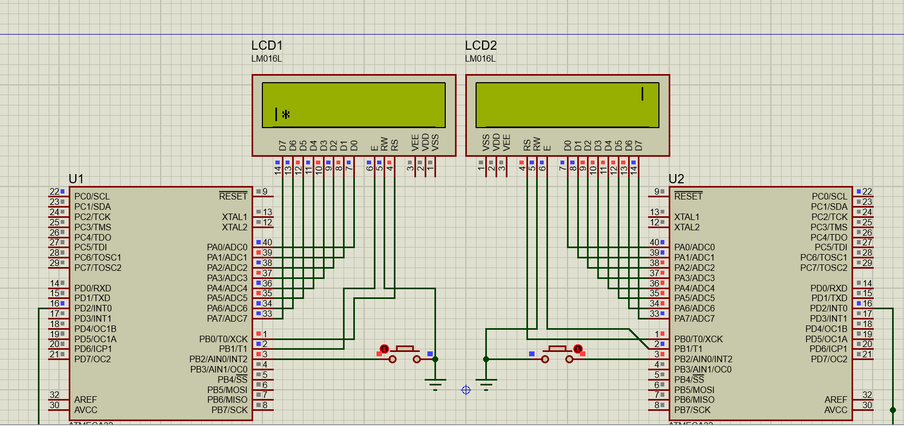

# ping pong game using atmega32 and interrupts

## tools
- 2 atmega32
- 2 LCD LM016
- 2 push button 

## Short description 
    ping pong game based on interrupt using an interrupt to toggle player position up and down 
    another interrupt is used to notify the other MC of the game and ball state  
    there are three states:  
    - 1 game end here MCsends one signal 
    - ball in the first row here mc send two signal 
    - ball in the second row here mc send three signal 

## screenshot of the simulation 
